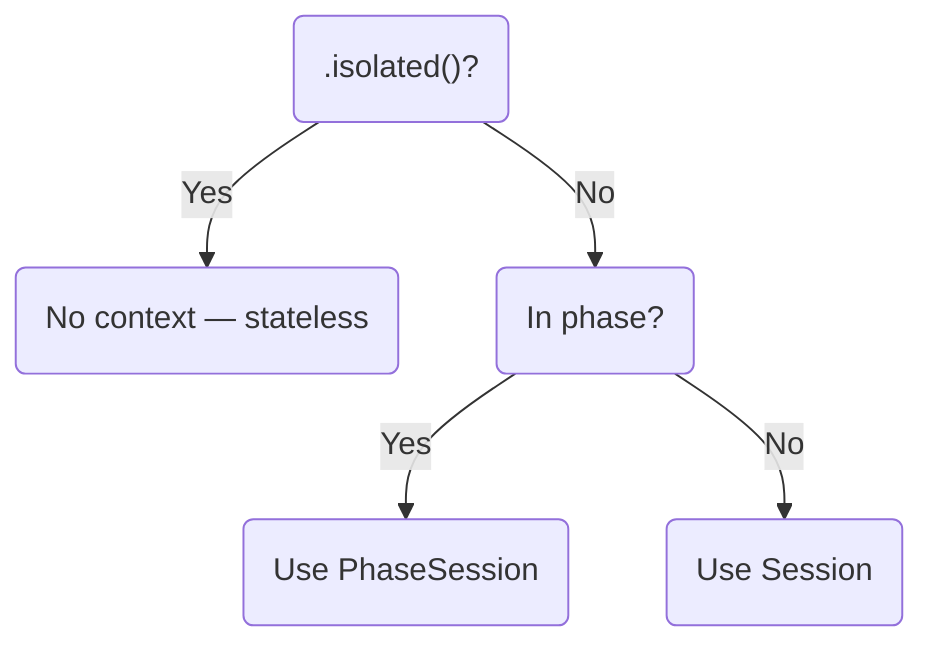

# ExecutionSpec

`ExecutionSpec[T]` is the core abstraction that enables Call-Spec discipline. It represents an agent call that hasn't been executed yet.

## What ExecutionSpec Captures

When you call an agent, you get an `af.ExecutionSpec`:

```python
spec = assistant("What is Python?")
```

This spec captures:

| Property | Description | Bound When | Axis |
|:---------|:------------|:-----------|:-----|
| `sdk_agent` | The underlying SDK Agent | At creation | WHAT |
| `input` | The prompt string | At creation | WHAT |
| `streaming` | Whether to stream events | Via `.stream()` | HOW |
| `is_silent` | Whether to suppress UI | Via `.silent()` | HOW |
| `is_isolated` | Whether to ignore context | Via `.isolated()` | WHERE |
| `max_turns_sdk` | Execution turn limit | Via `.max_turns(n)` | LIMITS |
| `run_kwargs` | SDK pass-through parameters | Via modifiers | Various |

## What ExecutionSpec Doesn't Capture

The spec does *not* bind to the execution environment:

- **Session** — Resolved at `await` time from `current_session`
- **Handler** — Resolved at `await` time from `current_handler`
- **Phase session** — Resolved at `await` time from `current_phase_session`

This means you can create a spec in one context and execute it in another:

```python
spec = assistant("Hello")  # Created outside phase

async with af.phase("Greeting"):
    result = await spec    # Executed inside phase — uses phase context
```

## The Type Parameter

`af.ExecutionSpec[T]` is generic. `T` is determined by the Agent's `output_type`:

```python
# T = str (default)
assistant = af.Agent(name="assistant", instructions="...", model="gpt-5.2")
spec: af.ExecutionSpec[str] = assistant("Hello")
result: str = await spec

# T = Analysis (Pydantic model)
class Analysis(BaseModel):
    sentiment: str
    score: float

analyzer = af.Agent(name="analyzer", instructions="...", output_type=Analysis, model="gpt-5.2")
spec: af.ExecutionSpec[Analysis] = analyzer("Analyze this text")
result: Analysis = await spec
result.sentiment  # IDE completion works
```

## Modifiers Return ExecutionSpec

Modifiers don't execute — they return a new `ExecutionSpec` with updated flags:

```python
spec1 = assistant("Hello")           # ExecutionSpec[str]
spec2 = spec1.stream()               # ExecutionSpec[str] with streaming=True
spec3 = spec2.silent()               # ExecutionSpec[str] with is_silent=True
spec4 = spec3.max_turns(5)      # ExecutionSpec[str] with max_turns_sdk=5

# spec1, spec2, spec3, spec4 are all unexecuted
```

Internally, modifiers use `dataclasses.replace`:

```python
def stream(self) -> ExecutionSpec[T]:
    return replace(self, streaming=True)

def max_turns(self, max_turns: int) -> ExecutionSpec[T]:
    return replace(self, max_turns_sdk=max_turns)
```

## Execution

Execution happens in `__await__`:

```python
def __await__(self):
    return self.execute().__await__()
```

The `execute()` method:

1. Resolves context (session, phase, handler)
2. Runs the SDK Agent
3. Updates phase context if applicable
4. Returns `T`

## Context Resolution

At execution time, `ExecutionSpec` resolves context in this order:



| Context | Session Read | Session Write | PhaseSession |
|:--------|:------------:|:-------------:|:------------:|
| Outside phase | Yes | Yes (SDK) | No |
| Inside phase | Inherited | No | Yes |
| `phase(persist=True)` | Inherited | At phase end | Yes |
| `.isolated()` | No | No | No |

!!! info "Accessing Context Explicitly"
    You can explicitly access `current_session`, `current_handler`, and `current_phase_session` using Python's contextvars. For details, see [Context Resolution](../context-resolution.md).

## Streaming Execution

When `streaming=True`, execution uses `Runner.run_streamed`:

```python
async def execute_streaming(self, input_data, session) -> T:
    stream = Runner.run_streamed(self.sdk_agent, input_data, session=session)

    async for event in stream.stream_events():
        if handler and not self.is_silent:
            handler(event)

    return stream.final_output
```

Events are forwarded to the handler unless `.silent()` is set.

## SDK Pass-Through Modifiers

ExecutionSpec provides pass-through modifiers for SDK `Runner.run()` parameters:

### .run_config()

Set RunConfig for execution:

```python
from agents import RunConfig

# Disable tracing
result = await agent("prompt").run_config(
    RunConfig(tracing_disabled=True)
)

# Override model for this execution
result = await agent("prompt").run_config(
    RunConfig(model="gpt-5.2-turbo")
)

# Set workflow name for tracing
result = await agent("prompt").run_config(
    RunConfig(workflow_name="my_workflow")
)
```

### .context()

Inject context for dependency injection:

```python
from dataclasses import dataclass

@dataclass
class AppContext:
    user_id: str
    db: Database

ctx = AppContext(user_id="123", db=db)
result = await agent("prompt").context(ctx)
```

!!! note "Context is local, not sent to LLM"
    The context object is for local code only (tools, hooks). It is not included in prompts sent to the LLM.

### .run_kwarg()

Set arbitrary SDK parameters:

```python
# Conversation chaining
result = await agent("prompt").run_kwarg(
    previous_response_id="resp_abc123",
    conversation_id="conv_xyz",
)
```

### Combining Pass-Through Modifiers

All modifiers can be combined:

```python
result = await agent("complex task") \
    .max_turns(10) \
    .context(app_ctx) \
    .run_config(RunConfig(tracing_disabled=True)) \
    .stream()
```

---

## Summary

`ExecutionSpec` embodies Call-Spec discipline:

- **Declaration**: Created by `agent(prompt)` — captures what to do
- **Modifiers**: `.stream()`, `.silent()`, `.isolated()`, `.max_turns(n)` — configure how
- **SDK Pass-through**: `.run_config()`, `.context()`, `.run_kwarg()` — SDK parameters
- **Execution**: `await` — runs the agent
- **Context**: Resolved at execution time — not bound at creation

---

Next: [Flow & Runner](flow-runner.md) :material-arrow-right:
