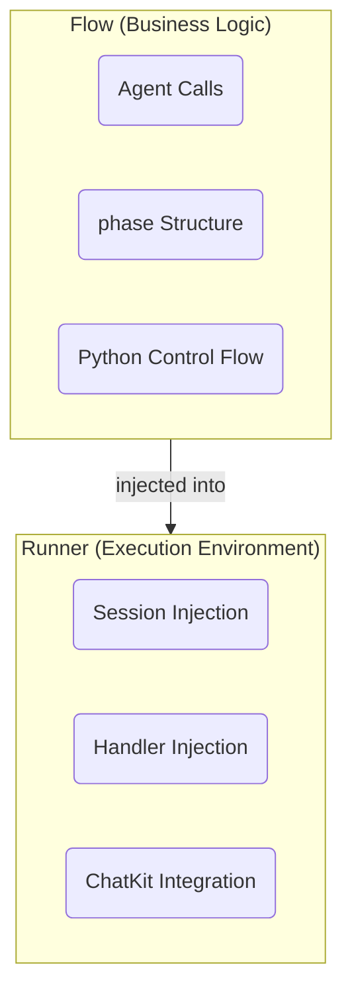

# Flow & Runner

AF separates **what** your workflow does (Flow) from **how** it's executed (Runner).

## Flow: Business Logic

A Flow is a regular async Python function:

```python
async def my_flow(user_message: str) -> str:
    async with af.phase("Research"):
        research = await researcher(user_message).stream()

    async with af.phase("Response", persist=True):
        return await responder(f"Based on: {research}").stream()
```

**Flow's responsibilities:**

| Responsibility | Example |
|:---------------|:--------|
| Agent call order | Which agents run in what sequence |
| Control flow | `if`, `for`, `while`, exception handling |
| Data transformation | Combining agent outputs |
| Phase structure | Where to put boundaries |

**Flow does NOT know about:**

- Sessions — Injected by Runner
- Handlers — Injected by Runner
- ChatKit — Integrated at Runner level

This separation keeps business logic clean.

## Runner: Execution Environment

A Runner wraps a Flow and provides the execution environment:

```python
import agentic_flow as af
from agents import SQLiteSession

runner = af.Runner(
    flow=my_flow,
    session=SQLiteSession("chat.db"),
    handler=my_handler,
)

result = await runner("Hello!")
```

**Runner's responsibilities:**

| Responsibility | How |
|:---------------|:----|
| Session injection | Via `contextvars` |
| Handler injection | Via `contextvars` |
| Flow execution | Calls `await self.flow(user_message)` |

## How Injection Works

Runner uses Python's `contextvars` to inject dependencies:

```python
async def __call__(self, user_message: str) -> Any:
    # Inject session
    session_token = current_session.set(self.session)

    # Inject handler
    handler_token = current_handler.set(self.handler)

    try:
        return await self.flow(user_message)
    finally:
        # Clean up
        current_handler.reset(handler_token)
        current_session.reset(session_token)
```

This means:

- Flow code never sees `session` or `handler` directly
- `af.ExecutionSpec.execute()` reads them from context when needed
- Context is properly scoped and cleaned up

## Synchronous Execution

Runner provides synchronous execution for scripts and Jupyter:

```python
# Option 1: run_sync()
result = runner.run_sync("Hello")

# Option 2: run().sync()
result = runner.run("Hello").sync()
```

Both methods handle event loop creation appropriately:

- **No running loop**: Uses `asyncio.run()`
- **Running loop (Jupyter)**: Uses a thread pool

!!! warning "sync() is a Runner adapter"
    `sync()` is NOT a third execution trigger for `af.ExecutionSpec`. It's a Runner-level convenience that internally awaits the flow.

## Working Without Runner

You can use agents without Runner — they'll just lack session context:

```python
import agentic_flow as af

assistant = af.Agent(name="assistant", instructions="...", model="gpt-5.2")

# Works, but no session
result = await assistant("Hello")
```

Each call is independent with no conversation history.

## Handler Pattern

Handlers receive streaming events:

```python
def my_handler(event):
    # Check for text delta
    if hasattr(event, "data") and hasattr(event.data, "delta"):
        print(event.data.delta, end="", flush=True)

    # Or check event type
    import agentic_flow as af
    if isinstance(event, af.PhaseStarted):
        print(f"\n[{event.label}]")
```

Handlers are called for:

- SDK `StreamEvent` objects (reasoning, text delta, tool calls)
- AF events (`af.PhaseStarted`, `af.PhaseEnded`, `af.AgentResult`)

## Summary

| Concept | Role |
|:--------|:-----|
| **Flow** | Business logic — agent orchestration |
| **Runner** | Execution environment — session/handler injection |
| **Session** | Conversation history (from SDK) |
| **Handler** | Event receiver for streaming output |
| **contextvars** | Injection mechanism |



---

Next: [Phase](phase.md) :material-arrow-right:
