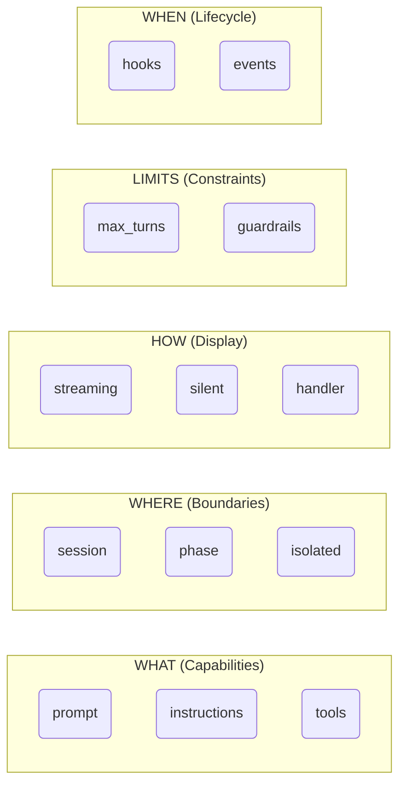

# Call-Spec Discipline

AF is built on a simple principle: **separate declaration from execution**.

## The Core Insight

In agent systems, mixing "what to do" with "when to do it" creates cognitive load for both humans and LLMs. When a function call immediately triggers execution, you can't read the code to understand when side effects occur.

AF addresses this by treating agent calls as *specifications* that only execute when explicitly awaited.

---

## The Problem: Why Call-Spec Matters

### Pure SDK + ChatKit: The Boilerplate Problem

Writing complex multi-agent flows with the Pure Agents SDK requires significant boilerplate:

??? example "Pure SDK — ~126 lines of ceremony"

    ```python
    --8<-- "docs/examples/pure_sdk_chatkit.py"
    ```

**What's wrong with this?**

- [x] Manual `emit_phase_label()` + `close_workflow()` for every phase
- [x] `async for event in stream_agent_response()` repeated everywhere
- [x] `try/finally` blocks to ensure `close_workflow()` on errors
- [x] af.Event queue management boilerplate
- [x] Business logic buried in infrastructure code

---

## The Solution: AF

The same workflow in AF:

=== "Flow Definition — 43 lines"

    ```python
    --8<-- "docs/examples/agenticflow_flow.py"
    ```

=== "ChatKit Server — 20 lines"

    ```python
    --8<-- "docs/examples/agenticflow_chatkit.py"
    ```

=== "CLI Usage — 16 lines"

    ```python
    --8<-- "docs/examples/agenticflow_cli.py"
    ```

---

## Side-by-Side Comparison

<div class="grid" markdown>

=== ":material-close: Pure SDK"

    ```python
    # Phase management
    emit_phase_label(ctx, "Research")
    result = Runner.run_streamed(agent, msgs, context=ctx)
    async for event in stream_agent_response(ctx, result):
        await queue.put(event)
    output = result.final_output
    await close_workflow(ctx)
    ```

=== ":material-check: AF"

    ```python
    # Phase management
    async with af.phase("Research"):
        output = await agent(msg).stream()
    ```

</div>

<div class="grid" markdown>

=== ":material-close: Pure SDK"

    ```python
    # Error handling
    try:
        emit_phase_label(ctx, "Work")
        # ... agent execution ...
        await close_workflow(ctx)
    except Exception:
        try:
            await close_workflow(ctx)
        except Exception:
            pass
        raise
    ```

=== ":material-check: AF"

    ```python
    # Error handling
    async with af.phase("Work"):
        result = await agent(msg).stream()
    # Cleanup is automatic
    ```

</div>

---

## Comparison Table

| Aspect | Pure SDK | AF |
|:-------|:--------:|:-----------:|
| **Lines of code** | ~126 | ~43 |
| **Phase management** | Manual `emit_phase_label` + `close_workflow` | Automatic `async with af.phase()` |
| **Streaming** | `async for event in stream_agent_response()` | `.stream()` |
| **Error handling** | Manual try/finally | Automatic cleanup |
| **af.Event queue** | Manual management | Handled internally |
| **Business logic** | Buried in boilerplate | Clear and visible |
| **Adding streaming** | Structural rewrite | Add `.stream()` |

---

## Declaration vs Execution

```python
import agentic_flow as af

assistant = af.Agent(name="assistant", instructions="Help the user.", model="gpt-5.2")

# Declaration — creates a specification
spec = assistant("What is Python?")

# Execution — runs the agent
result = await spec
```

**The specification (`ExecutionSpec`) captures:**

- Which agent to run
- What prompt to send
- How to run it (streaming, silent, isolated)

**Execution happens only when:**

- You `await` the specification

---

## The Five Axes

AF separates concerns into five orthogonal axes:



| Axis | Controls | Specified At |
|:-----|:---------|:-------------|
| **WHAT** | Agent capabilities | `af.Agent(...)`, `agent(prompt)` |
| **WHERE** | Data flow boundaries | `phase()`, `.isolated()`, `af.Runner(session=...)` |
| **HOW** | Display and observation | `.stream()`, `.silent()`, `af.Runner(handler=...)` |
| **LIMITS** | Execution constraints | `.max_turns()`, `.run_config()` |
| **WHEN** | Lifecycle observation | `af.Agent(hooks=...)`, events |

### WHAT — Agent Capabilities

Defines what the agent can do:

- `prompt` — The input message
- `instructions` — System prompt
- `tools` — Available tools
- `output_type` — Structured output schema
- `model`, `model_settings` — Model configuration
- `handoffs` — Delegation targets

### WHERE — Data Flow Boundaries

Controls where data flows:

- `Session` — Global conversation history
- `PhaseSession` — Local thinking space
- `.isolated()` — No context (stateless)
- `Context` — Dependency injection (SDK pass-through via `.context()`)

**These are NOT hidden.** You can explicitly access them:

```python
from agentic_flow.agent import current_session, current_handler, current_phase_session

async def my_flow(user_message: str):
    # Access current Session
    session = current_session.get()
    if session:
        history = await session.get_items()
        print(f"History: {len(history)} messages")

    # Access current Handler
    handler = current_handler.get()

    # Access current PhaseSession (if inside phase)
    phase_ctx = current_phase_session.get()

    result = await agent(user_message).stream()
    return result
```

AgenticFlow uses Python's `contextvars` to inject these dependencies. They are publicly accessible and documented.

:octicons-arrow-right-24: For details, see [Context Resolution](../context-resolution.md)

### HOW — Display and Observation

Controls how execution appears:

- `.stream()` — Real-time events
- `.silent()` — Suppress UI
- `handler` — Custom event processing
- `tracing` — Execution observation (SDK pass-through via `.run_config()`)

### LIMITS — Execution Constraints

Controls execution boundaries:

- `.max_turns(n)` — Limit agent turns
- `guardrails` — Input/output validation (SDK pass-through)
- `tool_use_behavior` — Tool execution control (SDK pass-through)

### WHEN — Lifecycle Observation

Observe execution lifecycle:

- `PhaseStarted`, `PhaseEnded` — AF events
- `AgentHooks` — Agent lifecycle (SDK pass-through)
- `RunHooks` — Execution lifecycle (SDK pass-through)

!!! warning "These axes don't mix"
    You can't pass `stream=True` to `agent()`. You can't pass `handler` to `phase()`. This separation is enforced by the API.

---

## The Single Execution Trigger

There is exactly one way to execute an agent: `await`.

```python
# These don't execute:
spec = agent("prompt")
spec = agent("prompt").stream()
spec = agent("prompt").silent().isolated()

# This executes:
result = await spec
```

This makes execution points visible in your code. You can read a flow and know exactly where agents run.

---

## Modifiers Are Declarative

Modifiers configure execution without triggering it:

```python
spec = assistant("Hello")          # ExecutionSpec
spec = spec.stream()               # Still ExecutionSpec (with streaming flag)
spec = spec.silent()               # Still ExecutionSpec (with silent flag)
result = await spec                # Now it executes
```

!!! tip "Modifier order doesn't matter"
    ```python
    await agent("prompt").stream().silent()    # Same as
    await agent("prompt").silent().stream()    # This
    ```

---

## Boundaries Are Explicit

`phase()` creates explicit execution boundaries:

```python
async with af.phase("Research"):
    # Boundary start is visible here
    result = await researcher(query).stream()
    # Boundary end is guaranteed (even on exception)
```

---

## Why This Matters

<div class="grid cards" markdown>

-   :material-account:{ .lg .middle } **For Humans**

    ---

    - **Readable**: Execution points visible by scanning for `await`
    - **Debuggable**: Set breakpoints at the single execution trigger
    - **Maintainable**: Adding streaming is one modifier, not a rewrite

-   :material-robot:{ .lg .middle } **For LLMs**

    ---

    - **Predictable**: No hidden state transitions to track
    - **Verifiable**: Invariants can be checked (boundaries always close)
    - **Autonomous**: Clearer code is easier for LLMs to understand

</div>

---

## Summary

| Principle | Implementation |
|:----------|:---------------|
| Call ≠ Execute | `agent(prompt)` returns `ExecutionSpec`, not result |
| Single trigger | Only `await` executes |
| Modifiers are flags | `.stream()`, `.silent()`, `.isolated()`, `.max_turns()` don't execute |
| Boundaries are visible | `async with af.phase()` marks start/end |
| Axes are separate | WHAT / WHERE / HOW / LIMITS / WHEN don't mix |

---

Next: [ExecutionSpec](execution-spec.md) :material-arrow-right:
