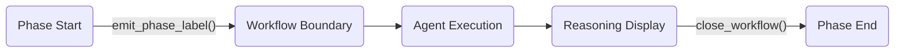

# Phase

`phase()` creates semantic boundaries in your workflow. It's where internal thinking happens — separate from user-facing conversation history.

## Basic Usage

```python
import agentic_flow as af

async def my_flow(user_message: str) -> str:
    async with af.phase("Research"):
        result = await researcher(user_message).stream()
    return result
```

## What phase() Does

1. **Creates a boundary** — Marks the start and end of a logical unit
2. **Manages context** — Creates a temporary `PhaseSession` for agent calls
3. **Emits events** — Sends `PhaseStarted`/`PhaseEnded` to handlers
4. **Integrates with ChatKit** — Creates workflow boundaries for UI display
5. **Guarantees cleanup** — Even on exceptions, the boundary closes

## Parameters

```python
async with af.phase(
    label="Research",       # Display name (required)
    share_context=True,     # Create af.PhaseSession (default: True)
    persist=False,          # Write to Session at end (default: False)
):
    ...
```

| Parameter | Default | Description |
|:----------|:--------|:------------|
| `label` | (required) | Name displayed in UI and passed to handlers |
| `share_context` | `True` | Create `PhaseSession` for agent history sharing |
| `persist` | `False` | Write last agent result to Session when phase ends |

## Context Behavior

### Default: Internal Thinking

```python
async with af.phase("Research"):
    r1 = await agent("query 1").stream()  # Recorded in af.PhaseSession
    r2 = await agent("query 2").stream()  # Sees r1's context
    # Nothing written to Session
```

History within the phase is discarded when the phase ends. This is intentional — internal thinking shouldn't pollute user-facing history.

### persist=True: Save to Session

```python
async with af.phase("Response", persist=True):
    r1 = await agent("draft").stream()
    r2 = await agent("refine").stream()
    # Last user/assistant pair written to Session
```

Only the **last** exchange is persisted. Intermediate steps remain internal.

### share_context=False: Isolated Read

```python
async with af.phase("Classification", share_context=False):
    result = await classifier(message).stream()
    # Can read Session history, but no af.PhaseSession
    # No write to Session
```

Use this when you need session history but don't want agents to share context within the phase.

## PhaseSession

When `share_context=True`, a `PhaseSession` is created. It implements SDK's `SessionABC` protocol:

```python
async with af.phase("Research") as ctx:
    await agent("query 1").stream()
    await agent("query 2").stream()

    # Access phase data
    ctx.my_data = "something"
    print(ctx.my_data)
```

`PhaseSession` provides:

- **`inherited_history`**: Session history at phase start (read-only)
- **`items`**: Messages within the phase (SDK-managed)
- **`data`**: Arbitrary data storage (accessible via attributes)
- **`get_items()`**: Returns `inherited_history + items` (async)

## Session Inheritance

Phases inherit session history at creation time:

```python
# Session has: [user: "Hi", assistant: "Hello"]

async with af.phase("Research"):
    # Agent sees: "Hi" → "Hello" (from Session)
    await agent("query").stream()
    # Agent sees: "Hi" → "Hello" + "query" → response
```

This allows agents within a phase to see past conversation while keeping their internal work separate.

## Nesting

Phases can be nested, but each creates its own context:

```python
async with af.phase("Outer"):
    await agent("outer query").stream()

    async with af.phase("Inner"):
        await agent("inner query").stream()
        # Has its own af.PhaseSession
```

## Event Flow

Phases emit events to handlers:

```python
import agentic_flow as af

def my_handler(event):
    if isinstance(event, af.PhaseStarted):
        print(f"Starting: {event.label}")
    elif isinstance(event, af.PhaseEnded):
        print(f"Ended: {event.label} ({event.elapsed_ms}ms)")
```

## ChatKit Integration

In ChatKit mode, phases create workflow boundaries:



Each phase gets its own "workflow" in the ChatKit UI, which enables:

- Independent reasoning display per phase
- Clear visual separation of phases
- Collapsible phase sections

## Summary

| Aspect | Behavior |
|:-------|:---------|
| Default | Internal thinking, discarded at phase end |
| `persist=True` | Last exchange saved to Session |
| `share_context=False` | Read Session, no PhaseSession |
| Cleanup | Guaranteed even on exception |
| Inheritance | Session history available to agents |
| Events | `af.PhaseStarted` / `af.PhaseEnded` emitted |

---

Next: [Modifiers](modifiers.md) :material-arrow-right:
