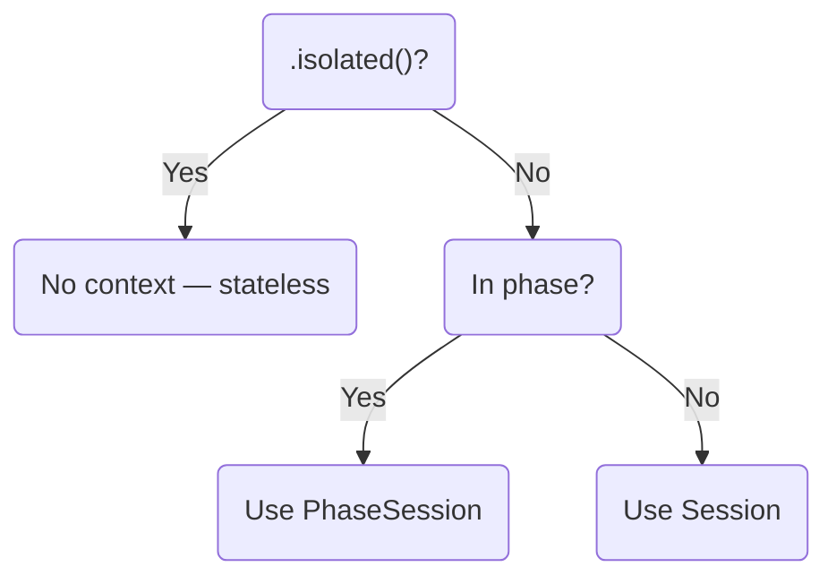

# Context Resolution

## Overview

AgenticFlow uses Python's `contextvars` module to manage execution context implicitly. This enables transparent context propagation without explicit parameter passing, allowing flows to access session, handler, and phase information from anywhere in the call stack.

## Available ContextVars

AgenticFlow defines 6 contextvars across 3 modules:

| ContextVar | Module | Purpose |
|:-----------|:-------|:--------|
| `current_session` | `agentic_flow.agent` | Current Session (conversation history) |
| `current_handler` | `agentic_flow.agent` | Current event Handler (UI callbacks) |
| `current_phase_session` | `agentic_flow.agent` | Current PhaseSession (inside phase with share_context=True) |
| `current_in_phase` | `agentic_flow.phase` | Boolean flag: currently inside any phase() |
| `current_phase_session_history` | `agentic_flow.phase` | Cached Session history (share_context=False) |
| `current_chatkit_context` | `agentic_flow.chatkit` | ChatKit execution context |

## Resolution Priority

When an agent executes, context is resolved in this priority order:

```
1. isolated=True        -> No context (raw input, no session)
2. phase(share_context=True)  -> PhaseSession (inherited + accumulated)
3. phase(share_context=False) -> Cached Session history (read-only)
4. Default (outside phase)    -> Global Session from Runner
```

This hierarchy ensures:

- **Isolation**: `.isolated()` always runs without context
- **Phase encapsulation**: Phase internal thinking stays in PhaseSession
- **Session integrity**: Global Session is only written when explicitly intended

### Resolution Flow



For a detailed explanation of how ExecutionSpec resolves context during execution, see [ExecutionSpec: Context Resolution](concepts/execution-spec.md#context-resolution).

## Usage

### Accessing Current Session

```python
from agentic_flow.agent import current_session

async def my_flow(user_message: str):
    # Get current Session (may be None if not set by Runner)
    session = current_session.get()
    if session:
        history = await session.get_items()
        print(f"History: {len(history)} messages")

    result = await agent(user_message).stream()
    return result
```

### Accessing Current Handler

```python
from agentic_flow.agent import current_handler

async def my_flow(user_message: str):
    handler = current_handler.get()
    if handler:
        # Handler receives SDK events and custom events
        from agentic_flow.types import PhaseStarted
        event = PhaseStarted(label="Custom Phase")
        result = handler(event)
        if hasattr(result, "__await__"):
            await result

    result = await agent(user_message).stream()
    return result
```

### Accessing Current Phase Session

```python
from agentic_flow.agent import current_phase_session

async def my_flow(user_message: str):
    # Only available inside phase(share_context=True)
    phase_session = current_phase_session.get()
    if phase_session:
        # Access phase info
        print(f"Phase: {phase_session.label}")
        items = await phase_session.get_items()
        print(f"Total items: {len(items)}")

        # Access custom phase data
        phase_session.my_data = "stored value"
        print(f"Custom data: {phase_session.data}")

    result = await agent(user_message).stream()
    return result
```

### Debugging Current Context

```python
from agentic_flow.agent import (
    current_session,
    current_handler,
    current_phase_session,
)
from agentic_flow.phase import current_in_phase

def debug_current_context():
    """Print current execution context state."""
    print(f"Session: {current_session.get()}")
    print(f"Handler: {current_handler.get()}")
    print(f"PhaseSession: {current_phase_session.get()}")
    print(f"In Phase: {current_in_phase.get()}")
```

## How Context is Injected

### By Runner

Runner sets `current_session` and `current_handler` when executing a flow:

```python
# Inside Runner.__call__()
async def __call__(self, user_message: str) -> Any:
    session_token = None
    if self.session is not None:
        session_token = current_session.set(self.session)

    handler_token = None
    if self.handler is not None:
        handler_token = current_handler.set(self.handler)

    try:
        return await self.flow(user_message)
    finally:
        if handler_token is not None:
            current_handler.reset(handler_token)
        if session_token is not None:
            current_session.reset(session_token)
```

### By phase()

The `phase()` context manager sets phase-specific context:

```python
async with phase("Research", share_context=True):
    # current_phase_session is now set to a PhaseSession instance
    # current_in_phase is True
    result = await agent(user_message).stream()

# After exiting:
# current_phase_session is reset to None
# current_in_phase is reset to False
```

For `share_context=False`:

```python
async with phase("Research", share_context=False):
    # current_phase_session is None
    # current_in_phase is True
    # current_phase_session_history contains cached Session history
    result = await agent(user_message).stream()
```

### By run_with_chatkit_context()

ChatKit integration sets `current_chatkit_context`:

```python
async for event in run_with_chatkit_context(runner, thread, store, context, user_message):
    # current_chatkit_context is set to ChatKitExecutionContext
    # Enables workflow boundary management for reasoning display
    yield event
```

## Context Resolution in ExecutionSpec

`ExecutionSpec.resolve_input()` implements the resolution priority:

```python
def resolve_input(self) -> tuple[Any, Any]:
    # 1. Isolated: no context
    if self.is_isolated:
        return self.input, None

    # 2. Phase with share_context=True: use PhaseSession
    phase_session = current_phase_session.get()
    if phase_session is not None:
        return self.input, phase_session  # SDK uses PhaseSession

    # 3. Phase with share_context=False: read-only cached history
    if current_in_phase.get():
        cached_history = current_phase_session_history.get()
        if cached_history is not None:
            user_msg = {"role": "user", "content": [{"type": "input_text", "text": self.input}]}
            return list(cached_history) + [user_msg], None
        return self.input, None

    # 4. Default: global Session
    session = current_session.get()
    return self.input, session
```

## Implementation Locations

| Component | Location |
|:----------|:---------|
| ContextVar declarations (agent) | `src/agentic_flow/agent.py:36-40` |
| ContextVar declarations (phase) | `src/agentic_flow/phase.py:33-39` |
| ContextVar declarations (chatkit) | `src/agentic_flow/chatkit.py:36-38` |
| Context resolution | `src/agentic_flow/agent.py:250-307` (`ExecutionSpec.resolve_input`) |
| Runner injection | `src/agentic_flow/runner.py:122-138` (`Runner.__call__`) |
| Phase scoping | `src/agentic_flow/phase.py:111-213` (`phase` context manager) |
| ChatKit injection | `src/agentic_flow/chatkit.py:182-287` (`run_with_chatkit_context`) |

## Best Practices

### Do

- Use `ContextVar.get()` to read context state
- Check for `None` before using context values
- Use contextvars for debugging and observability

### Do Not

- Do not manually `set()` contextvars unless implementing a new execution container
- Do not rely on contextvar state across `await` boundaries in concurrent code
- Do not store mutable state in contextvars that could be shared unexpectedly

## See Also

- [Phase](concepts/phase.md) - Phase context management
- [Flow & Runner](concepts/flow-runner.md) - Runner context injection
- [Modifiers](concepts/modifiers.md) - `.isolated()` and context control
