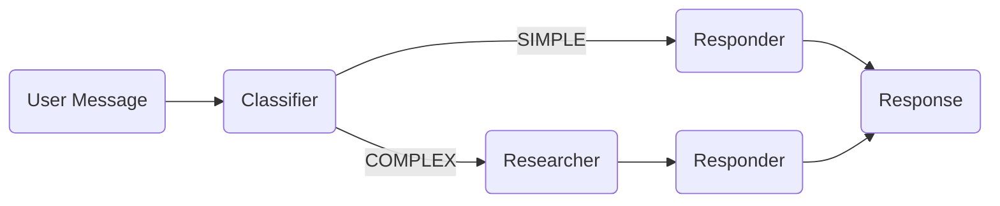

# Multi-Agent Workflow

This example demonstrates a multi-agent research workflow with classification, research, and response phases.

## Overview



## Complete Example

```python
import agentic_flow as af
from agents import SQLiteSession

# Define agents
classifier = af.Agent(
    name="classifier",
    instructions="""Classify the user's request as SIMPLE or COMPLEX.
    SIMPLE: Greetings, simple questions, basic information
    COMPLEX: Research questions, analysis, comparisons
    Respond with only SIMPLE or COMPLEX.""",
    model="gpt-5.2",
)

researcher = af.Agent(
    name="researcher",
    instructions="""Research the given topic thoroughly.
    Provide detailed findings with sources when possible.""",
    model="gpt-5.2",
    model_settings=af.reasoning("medium"),
)

responder = af.Agent(
    name="responder",
    instructions="""Provide a clear, helpful response to the user.
    If research findings are provided, base your response on them.""",
    model="gpt-5.2",
)


async def multi_agent_flow(user_message: str) -> str:
    # Phase 1: Classification
    async with af.phase("Classification"):
        classification = await classifier(user_message).stream()

    # Phase 2: Research (conditional)
    if "COMPLEX" in classification.upper():
        async with af.phase("Research"):
            research = await researcher(user_message).stream()
        context = f"Research findings:\n{research}"
    else:
        context = f"User message:\n{user_message}"

    # Phase 3: Response
    async with af.phase("Response", persist=True):
        return await responder(context).stream()


# Run
runner = af.Runner(
    flow=multi_agent_flow,
    session=SQLiteSession("multi_agent.db"),
)

result = runner.run_sync("What are the key differences between REST and GraphQL?")
print(result)
```

## Key Points

### Conditional Branching

Standard Python `if` statements control flow:

```python
if "COMPLEX" in classification.upper():
    async with af.phase("Research"):
        research = await researcher(user_message).stream()
```

### Phase Structure

- **Classification**: Quick categorization
- **Research**: Deep analysis (only for complex queries)
- **Response**: User-facing answer (persisted)

### Data Flow

Agent outputs flow through Python variables:

```python
classification = await classifier(msg).stream()  # str
research = await researcher(msg).stream()        # str
response = await responder(context).stream()     # str
```

## With Typed Output

Use Pydantic models for structured data:

```python
from pydantic import BaseModel

class Classification(BaseModel):
    category: str  # "SIMPLE" or "COMPLEX"
    confidence: float
    reason: str

classifier = af.Agent(
    name="classifier",
    instructions="Classify the request.",
    output_type=Classification,
    model="gpt-5.2",
)

async def typed_flow(user_message: str) -> str:
    async with af.phase("Classification"):
        result: Classification = await classifier(user_message).stream()

    if result.category == "COMPLEX" and result.confidence > 0.7:
        async with af.phase("Research"):
            research = await researcher(user_message).stream()
        context = f"Research:\n{research}"
    else:
        context = user_message

    async with af.phase("Response", persist=True):
        return await responder(context).stream()
```

## With Handler

Add streaming output for CLI:

```python
import agentic_flow as af

def cli_handler(event):
    if isinstance(event, af.PhaseStarted):
        print(f"\n[{event.label}]")
    elif isinstance(event, af.PhaseEnded):
        print(f"\n[/{event.label}]")
    elif hasattr(event, "data") and hasattr(event.data, "delta"):
        print(event.data.delta, end="", flush=True)

runner = af.Runner(
    flow=multi_agent_flow,
    session=SQLiteSession("multi_agent.db"),
    handler=cli_handler,
)
```

## Parallel Research

For independent research tasks, use `asyncio.gather` with `.isolated()`:

```python
import asyncio

async def parallel_research_flow(user_message: str) -> str:
    async with af.phase("Classification"):
        classification = await classifier(user_message).stream()

    if "COMPLEX" in classification.upper():
        async with af.phase("Research"):
            # Parallel research on different aspects
            results = await asyncio.gather(
                researcher(f"Technical aspects of: {user_message}").isolated(),
                researcher(f"Practical applications of: {user_message}").isolated(),
                researcher(f"Comparisons and alternatives for: {user_message}").isolated(),
            )
            research = "\n\n".join(results)
    else:
        research = user_message

    async with af.phase("Response", persist=True):
        return await responder(f"Based on research:\n{research}").stream()
```

---

Next: [Review Loop](review-loop.md) :material-arrow-right:
