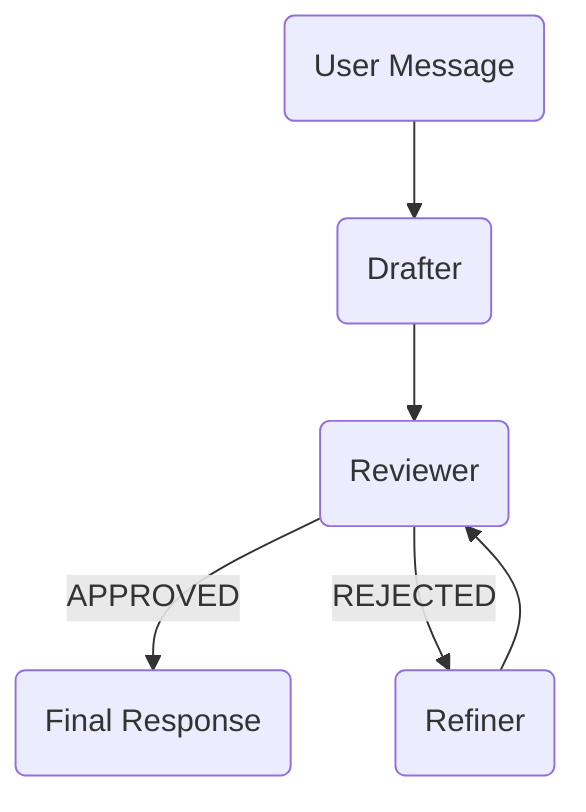

# Review Loop

This example demonstrates an iterative review and refinement workflow where content is improved until approved.

## Overview



## Complete Example

```python
import agentic_flow as af
from agents import SQLiteSession

# Define agents
drafter = af.Agent(
    name="drafter",
    instructions="""Create an initial draft response to the user's request.
    Be thorough but expect feedback for improvement.""",
    model="gpt-5.2",
)

reviewer = af.Agent(
    name="reviewer",
    instructions="""Review the draft critically.
    If acceptable, respond with: APPROVED
    If needs improvement, respond with: REJECTED
    Followed by specific feedback on what to improve.""",
    model="gpt-5.2",
    model_settings=af.reasoning("medium"),
)

refiner = af.Agent(
    name="refiner",
    instructions="""Improve the draft based on the reviewer's feedback.
    Address each point of feedback specifically.""",
    model="gpt-5.2",
)


async def review_loop_flow(user_message: str, max_iterations: int = 3) -> str:
    # Phase 1: Initial draft
    async with af.phase("Drafting"):
        draft = await drafter(user_message).stream()

    # Phase 2-N: Review and refine loop
    for attempt in range(max_iterations):
        async with af.phase(f"Review (attempt {attempt + 1})"):
            review = await reviewer(
                f"Draft:\n{draft}\n\nPlease review this draft."
            ).stream()

        if "APPROVED" in review.upper():
            break

        async with af.phase(f"Refinement (attempt {attempt + 1})"):
            draft = await refiner(
                f"Original request:\n{user_message}\n\n"
                f"Current draft:\n{draft}\n\n"
                f"Feedback:\n{review}"
            ).stream()

    # Final phase
    async with af.phase("Final Response", persist=True):
        return draft


# Run
runner = af.Runner(
    flow=review_loop_flow,
    session=SQLiteSession("review_loop.db"),
)

result = runner.run_sync("Write a professional email declining a job offer")
print(result)
```

## Key Points

### Loop Pattern

Standard Python `for` loop with early exit:

```python
for attempt in range(max_iterations):
    review = await reviewer(draft).stream()
    if "APPROVED" in review.upper():
        break
    draft = await refiner(draft, review).stream()
```

### Dynamic Phase Labels

Phase labels can be dynamic:

```python
async with af.phase(f"Review (attempt {attempt + 1})"):
    ...
```

### Data Accumulation

The draft evolves through iterations:

```python
draft = await drafter(message).stream()      # Initial
draft = await refiner(draft, feedback).stream()  # Refined
draft = await refiner(draft, feedback).stream()  # Further refined
```

## With Typed Review

Use structured output for clearer review decisions:

```python
from pydantic import BaseModel

class Review(BaseModel):
    approved: bool
    feedback: str | None = None
    issues: list[str] = []

reviewer = af.Agent(
    name="reviewer",
    instructions="Review the draft. Provide structured feedback.",
    output_type=Review,
    model="gpt-5.2",
)

async def typed_review_flow(user_message: str) -> str:
    async with af.phase("Drafting"):
        draft = await drafter(user_message).stream()

    for attempt in range(3):
        async with af.phase(f"Review {attempt + 1}"):
            review: Review = await reviewer(f"Draft:\n{draft}").stream()

        if review.approved:
            break

        if review.issues:
            feedback = "\n".join(f"- {issue}" for issue in review.issues)
        else:
            feedback = review.feedback or "General improvements needed"

        async with af.phase(f"Refinement {attempt + 1}"):
            draft = await refiner(
                f"Draft:\n{draft}\n\nIssues:\n{feedback}"
            ).stream()

    async with af.phase("Final", persist=True):
        return draft
```

## With Quality Threshold

Add a quality score to control iteration:

```python
class QualityReview(BaseModel):
    score: float  # 0-10
    approved: bool
    feedback: str

async def quality_review_flow(user_message: str, threshold: float = 8.0) -> str:
    async with af.phase("Drafting"):
        draft = await drafter(user_message).stream()

    for attempt in range(5):
        async with af.phase(f"Quality Check {attempt + 1}"):
            review: QualityReview = await reviewer(f"Draft:\n{draft}").stream()

        if review.approved and review.score >= threshold:
            break

        async with af.phase(f"Improvement {attempt + 1}"):
            draft = await refiner(
                f"Score: {review.score}/10\n"
                f"Target: {threshold}/10\n"
                f"Feedback: {review.feedback}\n"
                f"Draft:\n{draft}"
            ).stream()

    async with af.phase("Final", persist=True):
        return draft
```

## Streaming Progress

Show progress with a handler:

```python
import agentic_flow as af

def progress_handler(event):
    if isinstance(event, af.PhaseStarted):
        if "Review" in event.label:
            print(f"\nReviewing...")
        elif "Refinement" in event.label:
            print(f"\nRefining based on feedback...")
    elif isinstance(event, af.PhaseEnded):
        print(f" done ({event.elapsed_ms}ms)")
    elif hasattr(event, "data") and hasattr(event.data, "delta"):
        print(event.data.delta, end="", flush=True)

runner = af.Runner(
    flow=review_loop_flow,
    session=SQLiteSession("review.db"),
    handler=progress_handler,
)
```

## Best Practices

1. **Set max iterations** — Prevent infinite loops
2. **Clear approval criteria** — Make it unambiguous when to stop
3. **Accumulate context** — Pass original request to refiner
4. **Persist only final** — Use `persist=True` only on the last phase
5. **Use typed reviews** — Structured output makes decisions clearer

---

Back to: [Home](../index.md)
