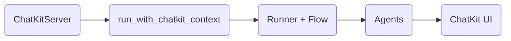

# ChatKit Integration

ChatKit provides a web UI for agent conversations. AF integrates with ChatKit through `run_with_chatkit_context`.

## Overview



## Server Setup

Create a `ChatKitServer` subclass:

```python
import agentic_flow as af
from agentic_flow.chatkit import run_with_chatkit_context
from agents import SQLiteSession
from chatkit.server import ChatKitServer
from chatkit.types import ThreadMetadata, UserMessageItem

from .flow import my_flow  # Your flow


class MyServer(ChatKitServer):
    async def respond(
        self,
        thread: ThreadMetadata,
        item: UserMessageItem | None,
        context: dict,
    ):
        # Extract user message
        user_message = ""
        if item and item.content:
            for part in item.content:
                if hasattr(part, "text"):
                    user_message += part.text

        # Create session and runner
        session = SQLiteSession(
            session_id=thread.id,
            db_path="data/sessions.db",
        )
        runner = af.Runner(flow=my_flow, session=session)

        # Execute with ChatKit context
        async for event in run_with_chatkit_context(
            runner, thread, self.store, context, user_message
        ):
            yield event
```

## FastAPI Integration

```python
from fastapi import FastAPI, Request
from fastapi.responses import Response, StreamingResponse
from chatkit.server import StreamingResult

app = FastAPI()
server = MyServer()


@app.post("/chatkit")
async def chatkit_endpoint(request: Request) -> Response:
    payload = await request.body()
    result = await server.process(payload, {"request": request})

    if isinstance(result, StreamingResult):
        return StreamingResponse(result, media_type="text/event-stream")
    return Response(content=result.json, media_type="application/json")
```

## Phase Labels in ChatKit

Each `phase()` creates a workflow boundary in ChatKit:

```python
async def my_flow(message: str) -> str:
    async with af.phase("Research"):      # ← Creates workflow boundary
        findings = await researcher(message).stream()

    async with af.phase("Response"):       # ← Creates new workflow boundary
        return await responder(findings).stream()
```

In the ChatKit UI:

- Each phase appears as a labeled section
- Reasoning steps display within their phase
- Phases are collapsible

## Workflow Boundaries

ChatKit uses "workflows" to group reasoning display. AF manages these automatically:

1. `phase()` start → `emit_phase_label()` → saves message to store
2. Agent execution → `stream_agent_response()` → creates workflow
3. `phase()` end → `close_workflow()` → ends workflow

This ensures each phase gets independent reasoning display.

## Handler vs ChatKit

When using `run_with_chatkit_context()`:

- **Handler is NOT used** — Events go to ChatKit's queue instead
- **Phase events still emit** — But to ChatKit, not handler

For CLI output with ChatKit backend, you'd need a separate handler setup.

## Silent Mode in ChatKit

`.silent()` suppresses ChatKit UI display:

```python
async with af.phase("Background"):
    # This output doesn't appear in ChatKit UI
    result = await agent(task).stream().silent()
```

The agent runs normally, but events aren't pushed to the UI queue.

## Error Handling

`run_with_chatkit_context` handles errors gracefully:

```python
# Errors are caught and displayed in ChatKit
async for event in run_with_chatkit_context(...):
    yield event
# If an error occurs, an error message is added to the thread
```

## Session with ChatKit

Session ID typically maps to thread ID:

```python
session = SQLiteSession(
    session_id=thread.id,  # Use thread ID for session
    db_path="data/sessions.db",
)
```

This ensures conversation history persists across page reloads.

## Complete Example

```python
import agentic_flow as af
from agentic_flow.chatkit import run_with_chatkit_context
from agents import SQLiteSession
from chatkit.server import ChatKitServer
from chatkit.types import ThreadMetadata, UserMessageItem
from fastapi import FastAPI, Request
from fastapi.responses import Response, StreamingResponse
from chatkit.server import StreamingResult

# Agents
researcher = af.Agent(
    name="researcher",
    instructions="Research topics thoroughly.",
    model="gpt-5.2",
    model_settings=af.reasoning("medium"),
)

responder = af.Agent(
    name="responder",
    instructions="Provide clear, helpful responses.",
    model="gpt-5.2",
)


# Flow
async def research_flow(message: str) -> str:
    async with af.phase("Research"):
        findings = await researcher(message).stream()

    async with af.phase("Response", persist=True):
        return await responder(f"Based on: {findings}").stream()


# Server
class ResearchServer(ChatKitServer):
    async def respond(self, thread: ThreadMetadata, item: UserMessageItem | None, context: dict):
        user_message = ""
        if item and item.content:
            for part in item.content:
                if hasattr(part, "text"):
                    user_message += part.text

        session = SQLiteSession(session_id=thread.id, db_path="data/sessions.db")
        runner = af.Runner(flow=research_flow, session=session)

        async for event in run_with_chatkit_context(
            runner, thread, self.store, context, user_message
        ):
            yield event


# FastAPI app
app = FastAPI()
server = ResearchServer()


@app.post("/chatkit")
async def chatkit_endpoint(request: Request) -> Response:
    payload = await request.body()
    result = await server.process(payload, {"request": request})

    if isinstance(result, StreamingResult):
        return StreamingResponse(result, media_type="text/event-stream")
    return Response(content=result.json, media_type="application/json")
```

---

Next: [Structured Output](structured-output.md) :material-arrow-right:
