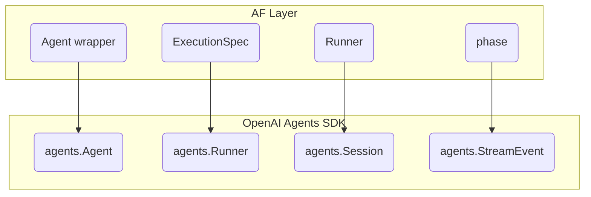

# SDK Compatibility

AF is built on top of the [OpenAI Agents SDK](https://openai.github.io/openai-agents-python/). This page documents the relationship and boundaries.

## Design Principle

**AF does not reinvent the SDK.** It adds:

- Callable form for agents (`agent(prompt)`)
- Execution modifiers (`.stream()`, `.silent()`, `.isolated()`)
- Automatic boundary management (`phase()`)
- Session injection via Runner

Everything else comes from the SDK.

## SDK Pass-Through

All Agent arguments pass directly to the SDK:

```python
# AF
import agentic_flow as af

agent = af.Agent(
    name="assistant",
    instructions="Help the user.",
    model="gpt-5.2",
    model_settings=ModelSettings(reasoning=Reasoning(effort="medium")),
    tools=[my_tool],
)

# Internally creates:
from agents import Agent as SDKAgent

sdk_agent = SDKAgent(
    name="assistant",
    instructions="Help the user.",
    model="gpt-5.2",
    model_settings=ModelSettings(reasoning=Reasoning(effort="medium")),
    tools=[my_tool],
)
```

This means:

- Future SDK arguments work automatically
- No need for AF updates when SDK changes
- No aliasing or normalization of arguments

## What Comes From SDK

| Feature | SDK Class | Usage in AF |
|:--------|:----------|:--------------------|
| Agent definition | `agents.Agent` | Wrapped by `Agent` |
| Execution | `agents.Runner` | Called by `ExecutionSpec` |
| Streaming | `agents.Runner.run_streamed` | Used when `.stream()` |
| Session | `agents.Session` | Injected by Runner |
| SQLiteSession | `agents.SQLiteSession` | Passed to Runner |
| StreamEvent | `agents.StreamEvent` | Forwarded to Handler |
| ModelSettings | `agents.ModelSettings` | Passed through |

## What AF Adds

| Feature | Purpose |
|:--------|:--------|
| `Agent[T]` | Callable wrapper, `agent(prompt) → ExecutionSpec[T]` |
| `ExecutionSpec[T]` | Declaration/execution separation |
| `phase()` | Automatic boundary management |
| `Runner` | Flow execution with injection |
| `.stream()` | Streaming mode modifier |
| `.silent()` | Display suppression modifier |
| `.isolated()` | Context isolation modifier |

## Session Compatibility

AF uses SDK Session directly:

```python
from agents import SQLiteSession

session = SQLiteSession(session_id="user_123", db_path="chat.db")
runner = af.Runner(flow=my_flow, session=session)
```

Session methods used:

- `get_items()` — Read history (by phase for inheritance)
- `add_items()` — Write history (by phase with `persist=True`)

## StreamEvent Handling

SDK StreamEvents are forwarded unchanged via `raw_response_event`:

```python
def my_handler(event):
    # AF events
    if isinstance(event, (af.PhaseStarted, af.PhaseEnded, af.AgentResult)):
        return

    # SDK events wrapped in raw_response_event
    if getattr(event, "type", None) == "raw_response_event":
        data = getattr(event, "data", None)
        data_type = getattr(data, "type", "")

        # Route by event type
        if data_type == "response.output_text.delta":
            print(data.delta, end="", flush=True)
```

### SDK Event Types

| Event Type | Description | Source |
|:-----------|:------------|:-------|
| `response.output_text.delta` | Text output | OpenAI Responses API |
| `response.reasoning_summary_text.delta` | Reasoning summary | OpenAI Responses API |
| `response.function_call_arguments.delta` | Tool arguments | OpenAI Responses API |
| `response.output_item.added` | New output item | OpenAI Responses API |
| `response.output_item.done` | Output complete | OpenAI Responses API |

These are from the OpenAI Responses API, forwarded by the Agents SDK, and passed through by AF.

AF adds its own events (`af.PhaseStarted`, `af.PhaseEnded`, `af.AgentResult`) but doesn't modify SDK events.

## Tool and Handoff Support

Tools and handoffs work as SDK features:

```python
def search_web(query: str) -> str:
    return f"Results for: {query}"

agent = af.Agent(
    name="researcher",
    instructions="Research topics using search.",
    model="gpt-5.2",
    tools=[search_web],  # Passed to SDK
)
```

From Flow's perspective, tool calls and handoffs are internal to agent execution. AF doesn't expose or interpret them — they're SDK behavior.

## output_type Support

Structured output uses SDK's implementation:

```python
from pydantic import BaseModel

class Analysis(BaseModel):
    sentiment: str

# Passed directly to SDK
agent = af.Agent(
    name="analyzer",
    instructions="Analyze sentiment.",
    output_type=Analysis,  # SDK handles this
    model="gpt-5.2",
)
```

## Version Compatibility

AF is tested with:

- `openai-agents` >= 0.1.0
- `openai-chatkit` >= 0.1.0 (for ChatKit integration)

For production, pin versions:

```toml
[project]
dependencies = [
    "agentic-flow>=0.35",
    "openai-agents==0.1.0",
    "openai-chatkit==0.1.0",
]
```

## Execution-Time Pass-Through

In addition to Agent definition pass-through, AF supports execution-time parameters via modifiers:

### Runner.run() Parameters

| SDK Parameter | AF Modifier | Status |
|:--------------|:--------------------|:-------|
| `max_turns` | `.max_turns(n)` | Supported |
| `run_config` | `.run_config(cfg)` | Supported |
| `context` | `.context(ctx)` | Supported |
| `previous_response_id` | `.run_kwarg(...)` | Pass-through |
| `conversation_id` | `.run_kwarg(...)` | Pass-through |
| `session` | `af.Runner(session=...)` | Injected |

### RunConfig Options

| Option | Description | Axis |
|:-------|:------------|:-----|
| `model` | Override agent's model | WHAT |
| `model_settings` | Override model settings | WHAT |
| `tracing_disabled` | Disable tracing | HOW |
| `trace_include_sensitive_data` | Include data in traces | HOW |
| `workflow_name` | Name for tracing | HOW |
| `input_guardrails` | Override input guardrails | LIMITS |
| `output_guardrails` | Override output guardrails | LIMITS |
| `hooks` | Run-level hooks | WHEN |

### Example

```python
from agents import RunConfig

# Combine multiple execution-time settings
result = await agent("complex task") \
    .max_turns(10) \
    .context(app_context) \
    .run_config(RunConfig(
        tracing_disabled=True,
        workflow_name="my_workflow",
    )) \
    .stream()
```

---

## SDK Features Comparison

| SDK Feature | AF Support | Notes |
|:------------|:-------------------|:------|
| Agent definition | Full pass-through | All Agent kwargs supported |
| Runner.run() params | Via modifiers | `.max_turns()`, `.context()`, etc. |
| Guardrails | Pass-through | Via af.Agent() or RunConfig |
| AgentHooks | Pass-through | Via af.Agent(hooks=...) |
| RunHooks | Pass-through | Via RunConfig |
| Context (DI) | Via `.context()` | |
| Tracing | SDK default | Disable via RunConfig |
| MCP | Pass-through | Via tools parameter |

---

## Non-Goals

Things AF intentionally does not do:

| Non-Goal | Reason |
|:---------|:-------|
| Replace SDK Session | Use SDK's implementation |
| Custom output parsing | SDK handles structured output |
| Expose handoff details | Handoffs are SDK-internal |
| Modify StreamEvents | Forward unchanged |
| Provide default models | Use SDK defaults |
| Wrap guardrails | Use SDK directly |
| Wrap hooks | Use SDK directly |
| Custom tracing | Use SDK tracing |

## Architecture



AF is a thin layer. The SDK does the heavy lifting.
