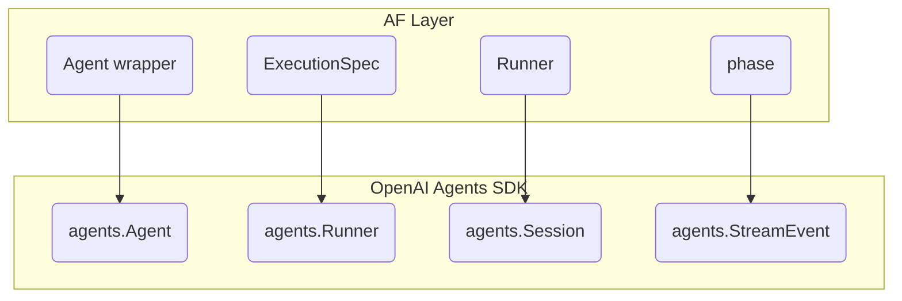

# SDK Compatibility

AF is built on top of the [OpenAI Agents SDK](https://openai.github.io/openai-agents-python/). This page documents the relationship and boundaries.

## Design Principle

**AF does not reinvent the SDK.** It adds:

- Callable form for agents (`agent(prompt)`)
- Execution modifiers (`.stream()`, `.silent()`, `.isolated()`, `.snapshot()`)
- Automatic boundary management (`phase()`)
- Session injection via Runner

Everything else comes from the SDK.

## SDK Pass-Through

All Agent arguments pass directly to the SDK:

```python
# AF
import agentic_flow as af

agent = af.Agent(
    name="assistant",
    instructions="Help the user.",
    model="gpt-5.5",
    model_settings=ModelSettings(reasoning=Reasoning(effort="medium")),
    tools=[my_tool],
)

# Internally creates:
from agents import Agent as SDKAgent

sdk_agent = SDKAgent(
    name="assistant",
    instructions="Help the user.",
    model="gpt-5.5",
    model_settings=ModelSettings(reasoning=Reasoning(effort="medium")),
    tools=[my_tool],
)
```

This means:

- Future SDK arguments work automatically
- No need for AF updates when SDK changes
- No aliasing or normalization of arguments

## What Comes From SDK

| Feature | SDK Class | Usage in AF |
|:--------|:----------|:--------------------|
| Agent definition | `agents.Agent` | Wrapped by `Agent` |
| Execution | `agents.Runner` | Called by `ExecutionSpec` |
| Streaming | `agents.Runner.run_streamed` | Used when `.stream()` |
| Session | `agents.Session` | Injected by Runner |
| SQLiteSession | `agents.SQLiteSession` | Passed to Runner |
| StreamEvent | `agents.StreamEvent` | Consumed internally (not forwarded to Handler) |
| ModelSettings | `agents.ModelSettings` | Passed through |

## What AF Adds

| Feature | Purpose |
|:--------|:--------|
| `Agent[T]` | Callable wrapper, `agent(prompt) → ExecutionSpec[T]` |
| `SandboxAgent[T]` | Subclass of `Agent[T]` that constructs `agents.sandbox.SandboxAgent` |
| `ExecutionSpec[T]` | Declaration/execution separation |
| `phase()` | Automatic boundary management |
| `Runner` | Flow execution with injection |
| `.stream()` | Streaming mode modifier |
| `.silent()` | Display suppression modifier |
| `.isolated()` | Context isolation modifier |
| `.snapshot()` | Read-only context modifier |

## Session Compatibility

AF uses SDK Session directly:

```python
from agents import SQLiteSession

session = SQLiteSession(session_id="user_123", db_path="chat.db")
runner = af.Runner(flow=my_flow, session=session)
```

Session methods used:

- `get_items()` — Read history (by phase for inheritance)
- `add_items()` — Write history (by phase with `persist=True`)

## Handler Events

SDK StreamEvent deltas are consumed internally by `execute()` and `execute_streaming()`. They are **not** forwarded to the handler. Display is always full-text-at-once.

Handler receives AF events only:

```python
import agentic_flow as af

def my_handler(event):
    if isinstance(event, af.PhaseStarted):
        print(f"\n[{event.label}]")
    elif isinstance(event, af.PhaseEnded):
        print(f"  ({event.elapsed_ms}ms)")
    elif isinstance(event, af.AgentResult):
        print(event.content)
```

### AF Event Types

| Event | When Emitted | Key Fields |
|:------|:-------------|:-----------|
| `AgentResult` | After each agent execution | `content: Any` (full output) |
| `PhaseStarted` | On `phase()` entry | `label: str` |
| `PhaseEnded` | On `phase()` exit | `label: str`, `elapsed_ms: int` |

Display fallback priority: ChatKit > Handler > `print()` (mutually exclusive). When no handler or ChatKit context is active, output is printed to stdout.

## Tool and Handoff Support

Tools and handoffs work as SDK features:

```python
def search_web(query: str) -> str:
    return f"Results for: {query}"

agent = af.Agent(
    name="researcher",
    instructions="Research topics using search.",
    model="gpt-5.5",
    tools=[search_web],  # Passed to SDK
)
```

From Flow's perspective, tool calls and handoffs are internal to agent execution. AF doesn't expose or interpret them — they're SDK behavior.

## output_type Support

Structured output uses SDK's implementation:

```python
from pydantic import BaseModel

class Analysis(BaseModel):
    sentiment: str

# Passed directly to SDK
agent = af.Agent(
    name="analyzer",
    instructions="Analyze sentiment.",
    output_type=Analysis,  # SDK handles this
    model="gpt-5.5",
)
```

## Multi-Provider Support

AF supports multiple LLM providers through the SDK's built-in multi-provider system.

### Quick Start

| Provider | Agent Definition |
|:---------|:-----------------|
| OpenAI (default) | `af.Agent(model="gpt-5.5")` |
| Anthropic (via LiteLLM) | `af.Agent(model="litellm/anthropic/claude-sonnet-4-20250514")` |
| Google (via LiteLLM) | `af.Agent(model="litellm/google/gemini-2.0-flash")` |
| Custom | `RunConfig(model_provider=MyProvider())` |

### Runtime Override

```python
from agents import RunConfig

result = await agent("prompt").run_config(
    RunConfig(model="gpt-5.5")
).stream()
```

For details, see the [Multi-Provider Guide](../guides/multi-provider.md).

## Version Compatibility

AF is tested with:

- `openai-agents` >= 0.14.0, < 0.15
- `openai-chatkit` >= 1.5.3, < 2 (for ChatKit integration)

For production, pin versions:

```toml
[project]
dependencies = [
    "ds-agentic-flow>=0.38",
    "openai-agents>=0.14.0,<0.15",
    "openai-chatkit>=1.5.3,<2",
]
```

The SDK 0.14 line introduced `agents.sandbox` (Sandbox Agents) and populated `agents.extensions.memory` with multiple session backends (SQLAlchemy, MongoDB, Redis, Dapr, encrypted, async/advanced SQLite). Both are available to AF users without further wrapping. See the [Sandbox Agents concept page](../concepts/sandbox.md) for the AF surface, and the [SDK 0.14.6 Refresh Discovery Report](../refresh-0.14.md) for the verification trail.

## Execution-Time Pass-Through

In addition to Agent definition pass-through, AF supports execution-time parameters via modifiers:

### Runner.run() Parameters

| SDK Parameter | AF Modifier | Status |
|:--------------|:--------------------|:-------|
| `max_turns` | `.max_turns(n)` | Supported |
| `run_config` | `.run_config(cfg)` | Supported |
| `context` | `.context(ctx)` | Supported |
| `previous_response_id` | `.run_kwarg(...)` | Pass-through |
| `conversation_id` | `.run_kwarg(...)` | Pass-through |
| `session` | `af.Runner(session=...)` | Injected |

### RunConfig Options

| Option | Description | Axis |
|:-------|:------------|:-----|
| `model` | Override agent's model | WHAT |
| `model_settings` | Override model settings | WHAT |
| `tracing_disabled` | Disable tracing | HOW |
| `tracing` | Tracing configuration | HOW |
| `trace_include_sensitive_data` | Include data in traces | HOW |
| `workflow_name` | Name for tracing | HOW |
| `input_guardrails` | Override input guardrails | LIMITS |
| `output_guardrails` | Override output guardrails | LIMITS |
| `hooks` | Run-level hooks | WHEN |
| `sandbox` | Sandbox runtime config (`SandboxRunConfig`) | WHERE |
| `session_settings` | Session behavior settings | WHERE |
| `session_input_callback` | Customize session input | WHERE |
| `nest_handoff_history` | Nest handoff history | WHAT |
| `handoff_history_mapper` | Map handoff history | WHAT |
| `call_model_input_filter` | Filter model input | WHAT |
| `tool_error_formatter` | Format tool errors | LIMITS |
| `reasoning_item_id_policy` | Reasoning item id policy | HOW |

### Example

```python
from agents import RunConfig

# Combine multiple execution-time settings
result = await agent("complex task") \
    .max_turns(10) \
    .context(app_context) \
    .run_config(RunConfig(
        tracing_disabled=True,
        workflow_name="my_workflow",
    )) \
    .stream()
```

---

## SDK Features Comparison

| SDK Feature | AF Support | Notes |
|:------------|:-------------------|:------|
| Agent definition | Full pass-through | All Agent kwargs supported |
| Multi-Provider | Via SDK `ModelProvider` | Use `model="litellm/..."` or `RunConfig(model_provider=...)` |
| Runner.run() params | Via modifiers | `.max_turns()`, `.context()`, etc. |
| Guardrails | Pass-through | Via af.Agent() or RunConfig |
| AgentHooks | Pass-through | Via af.Agent(hooks=...) |
| RunHooks | Pass-through | Via RunConfig |
| Context (DI) | Via `.context()` | |
| Tracing | SDK default | Disable via RunConfig |
| MCP | Pass-through | Via tools parameter |

---

## Non-Goals

Things AF intentionally does not do:

| Non-Goal | Reason |
|:---------|:-------|
| Replace SDK Session | Use SDK's implementation |
| Custom output parsing | SDK handles structured output |
| Expose handoff details | Handoffs are SDK-internal |
| Modify StreamEvents | Forward unchanged |
| Provide default models | Use SDK defaults |
| Wrap guardrails | Use SDK directly |
| Wrap hooks | Use SDK directly |
| Custom tracing | Use SDK tracing |
| Custom provider abstraction | SDK provides `ModelProvider` and `MultiProvider` |

## Architecture


```mermaid
graph TB
    subgraph AF["AF Layer"]
        A(Agent wrapper)
        B(ExecutionSpec)
        C(phase)
        D(Runner)
    end

    subgraph SDK["OpenAI Agents SDK"]
        E(agents.Agent)
        F(agents.Runner)
        G(agents.Session)
        H(agents.StreamEvent)
    end

    A --> E
    B --> F
    D --> G
    C --> H
```

AF is a thin layer. The SDK does the heavy lifting.
