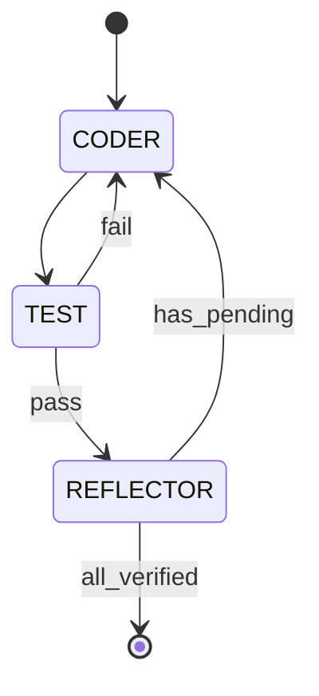
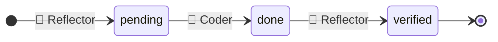

# ✨ AgenticTranscoder

**Transform OpenAI AgentBuilder code into clean Agentic Flow projects.**

<table>
<tr>
<th>Before: AgentBuilder (174 lines)</th>
<th>After: Agentic Flow (115 lines)</th>
</tr>
<tr>
<td>

```python
from pydantic import BaseModel
from agents import (
    Agent, ModelSettings, Runner,
    RunConfig, TResponseInputItem, trace,
)
from openai.types.shared.reasoning import Reasoning

class ClassifySchema(BaseModel):
    category: str

classify = Agent(name="Classify", ...)
cook = Agent(name="cook", ...)
meteorologist = Agent(name="meteorologist", ...)

class WorkflowInput(BaseModel):
    input_as_text: str

async def run_workflow(workflow_input: WorkflowInput):
    with trace("Router workflow"):
        workflow = workflow_input.model_dump()
        conversation_history: list[TResponseInputItem] = [
            {"role": "user", "content": [...]}
        ]

        result = await Runner.run(
            classify,
            input=[{"role": "user", "content": [...]}],
            run_config=RunConfig(
                trace_metadata={"__trace_source__": ...}
            ),
        )
        category = result.final_output.model_dump()["category"]

        if category == "cook":
            cook_result = await Runner.run(
                cook, input=[*conversation_history],
                run_config=RunConfig(...),
            )
            conversation_history.extend(
                [item.to_input_item()
                 for item in cook_result.new_items]
            )
            return {"output_text": ...}

        elif category == "meteorologist":
            # ... similar pattern repeated ...
```

</td>
<td>

```python
from pydantic import BaseModel
from agentic_flow import Agent, reasoning

class ClassifyResult(BaseModel):
    category: str

classify = Agent(name="classify", ...)
cook = Agent(name="cook", ...)
meteorologist = Agent(name="meteorologist", ...)

# flow.py
from agentic_flow import phase
from agent_specs import classify, cook, meteorologist

async def router_flow(message: str) -> str:
    async with phase("Classify"):
        result = await classify(message).stream()

    if result.category == "cook":
        async with phase("Response", persist=True):
            return await cook(message).stream()

    if result.category == "meteorologist":
        async with phase("Response", persist=True):
            return await meteorologist(message).stream()

    return result.model_dump_json()
```

</td>
</tr>
</table>

⚡ Autonomous transformation with test-fix cycles.

---

## 📋 Requirements

- Python 3.12+
- OpenAI API key in `.env.local`

---

## 📦 Installation

```bash
cd sample/AgenticTranscoder
uv sync
```

---

## 🚀 Usage

```bash
# Initialize workspace
uv run transcoder init

# Transform (defaults to ./workspace/builder_agent.py)
uv run transcoder

# Transform specific file
uv run transcoder -f ./workspace/my_agent.py

# Specify output directory
uv run transcoder -f ./input.py -o ./output_af

# Reset: remove generated *_af directories
uv run transcoder reset

# Delete: remove entire workspace
uv run transcoder delete
uv run transcoder del      # alias
```

---

## 🔬 Formal Specification

### 🔄 State Machine

Three-state machine with two agents (CODER, REFLECTOR) and one function (TEST).

<div align="center">



</div>

**Definition 1 (States).** $S = \{\text{CODER}, \text{TEST}, \text{REFLECTOR}\}$

**Definition 2 (Transition Function).** $\delta: S \times \Sigma \to S$:

| Current | Condition | Next |
|---------|-----------|------|
| CODER | — | TEST |
| TEST | $\tau.\text{failed}$ | CODER |
| TEST | $\neg\tau.\text{failed}$ | REFLECTOR |
| REFLECTOR | $\exists t: \sigma(t) = \text{pending}$ | CODER |
| REFLECTOR | $\forall t: \sigma(t) = \text{verified}$ | DONE |

*Note: CODER uses different prompts (Generate/Fix/Improve) based on context, but this is an implementation detail, not a state distinction.*

### 👥 Agents

| Agent | Capability | Output |
|-------|------------|--------|
| 🔧 Coder | read, write, execute | String |
| 🧪 Test | execute | RunResult |
| 💎 Reflector | read, add_todo, verify_todo | ReflectionResult |

### 📝 Todo Lifecycle



**Invariant.** $\forall t \in T: \sigma(t) = \text{verified} \Rightarrow \text{testPassed}(t)$

---

## 🎁 Generated Project

```
workspace/builder_agent_af/
├── agent_specs.py         # Agent definitions
├── flow.py                # Flow with phase
├── server.py              # FastAPI + ChatKit
├── store.py               # SQLite persistence
├── pyproject.toml
├── frontend/              # React + ChatKit UI
└── tests/
```

Start the project:

```bash
cd workspace/builder_agent_af

# Backend
uv run uvicorn server:app --port 8000

# Frontend (new terminal)
cd frontend && npm install && npm run dev
```

---

## 📁 Project Structure

```
agentic_transcoder/
├── src/agentic_transcoder/
│   ├── flow.py              # State machine
│   ├── cli.py               # CLI entry point
│   ├── tools.py             # run_tests, format_errors
│   ├── types.py             # RunResult, TestError
│   ├── agents/
│   │   ├── tools.py         # load_skill, file tools
│   │   ├── coder/           # 🔧 Coder agent
│   │   └── reflector/       # 💎 Reflector agent
│   ├── console/             # Rich display
│   ├── template/            # Project template
│   └── knowledge/           # Transformation rules
├── examples/                # Reference implementations
├── fixtures/                # Sample input
└── tests/
```

---

## 🧪 Testing

```bash
# Run all tests
uv run pytest tests/ -v

# Test example imports
cd examples/basic && uv run python -c "from flow import chat_flow; print('OK')"
```
